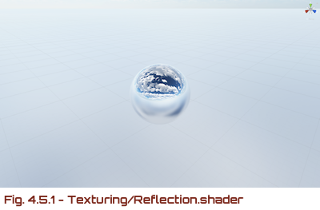

# 

Unity Shader Code with “BASIC×SHADER”


* [Getting Started](#getting-started)
* [#3 Lighting](#3-lighting)
    * [#3.1 Ambient](#31-ambient)
    * [#3.2 Diffuse](#32-diffuse)
    * [#3.3 Specular](#33-specular)
    * [#3.4 Phong](#34-phong)
    * [#3.5 Blinn-Phong](#35-blinn-phong)
    * [#3.6 Rim](#36-rim)
    * [#3.7 Toon](#37-toon)
    * [#3.8 Oren-Nayar](#38-oren-nayar)
    * [#3.9 Cook-Torrance](#39-cook-torrance)
    * [#3.10 SH](#310-sh)
    * [#3.11 Point/Spot](#311-pointspot)
* [#4 Texturing](#4-texturing)
    * [#4.1 Color](#41-color)
    * [#4.2 Gloss](#42-gloss)
    * [#4.3 Bump](#43-bump)
    * [#4.4 Parallax](#44-parallax)
    * [#4.5 Reflection](#45-reflection)
    * [#4.6 Refraction](#46-refraction)
* [#5 Shadow](#5-shadow)
    * [#5.1 Projection](#51-projection)
    * [#5.2 Volume](#52-volume)
    * [#5.3 Map](#53-map)
* [#6 Fog](#6-fog)
    * [#6.1 Depth](#61-depth)
    * [#6.2 Distance](#62-distance)
    * [#6.3 Height](#63-height)
* [#7 PostEffect](#7-posteffect)
    * [#7.1 Original](#71-original)
    * [#7.2 Negaposi](#72-negaposi)
    * [#7.3 Grayscale](#73-grayscale)
    * [#7.4 Sepia](#74-sepia)
    * [#7.5 Threshold](#75-threshold)
    * [#7.6 Mosaic](#76-mosaic)
    * [#7.7 LED](#77-led)
    * [#7.8 Noise](#78-noise)
    * [#7.9 Scanline](#79-scanline)
    * [#7.10 Twirl](#710-twirl)
    * [#7.11 Fisheye](#711-fisheye)
    * [#7.12 Sobel](#712-sobel)
    * [#7.13 Kuwahara](#713-kuwahara)
    * [#7.14 FXAA](#714-fxaa)
    * [#7.15 ZoomBlur](#715-zoomblur)
    * [#7.16 MotionBlur](#716-motionblur)
    * [#7.17 GaussianBlur](#717-gaussianblur)
    * [#7.18 Bloom](#718-bloom)
    * [#7.19 DOF](#719-dof)
    * [#7.20 SSAO](#720-ssao)

## Getting Started


To set a shader to Unity object, assign through a material. Let's create **object** for display, **material** for the object, and **shader** for the material.

### Object

Create a sphere object via `GameObject > 3D Object > Sphere` from the Unity Editor menu.


### Material

Create a material file via `Assets > Create > Material` from the Unity Editor menu. Assign the material to the object.


### Shader

Create a shader file via `Assets > Create > Shader > Unlit Shader` from the Unity Editor menu. Replace the contents of shader with the code below and assign the shader to the material.


```shader
Shader "BASICxSHADER/Unlit" {
  SubShader {
    Pass {
      CGPROGRAM
      #pragma vertex vert
      #pragma fragment frag

      float4 vert(float4 vertex : POSITION) : SV_POSITION {
        return UnityObjectToClipPos(vertex);
      }

      fixed4 frag() : SV_Target {
        return fixed4(1.0, 0, 0, 1.0);
      }
      ENDCG
    }
  }
}
```

## #3 Lighting

### #3.1 Ambient

* [Ambient.shader](shaders/Lighting/Ambient.shader)


### #3.2 Diffuse

* [Diffuse.shader](shaders/Lighting/Diffuse.shader)


### #3.3 Specular

* [Specular.shader](shaders/Lighting/Specular.shader)


### #3.4 Phong

* [Phong.shader](shaders/Lighting/Phong.shader)


### #3.5 Blinn-Phong

* [Blinn-Phong.shader](shaders/Lighting/Blinn-Phong.shader)


### #3.6 Rim

* [Rim.shader](shaders/Lighting/Rim.shader)


### #3.7 Toon

* [Toon.shader](shaders/Lighting/Toon.shader)


### #3.8 Oren-Nayar

* [Oren-Nayar.shader](shaders/Lighting/Oren-Nayar.shader)


### #3.9 Cook-Torrance

* [Cook-Torrance.shader](shaders/Lighting/Cook-Torrance.shader)


### #3.10 SH

* [SH.shader](shaders/Lighting/SH.shader)


### #3.11 Point/Spot

* [PointSpot.shader](shaders/Lighting/PointSpot.shader)
* [PointSpotLUT.shader](shaders/Lighting/PointSpotLUT.shader)


## #4 Texturing

### #4.1 Color

* [Color.shader](shaders/Texturing/Color.shader)


### #4.2 Gloss

* [Gloss.shader](shaders/Texturing/Gloss.shader)


### #4.3 Bump

* [Bump.shader](shaders/Texturing/Bump.shader)


### #4.4 Parallax

* [Parallax.shader](shaders/Texturing/Parallax.shader)


### #4.5 Reflection

* [Reflection.shader](shaders/Texturing/Reflection.shader)



### #4.6 Refraction

* [Refraction.shader](shaders/Texturing/Refraction.shader)


## #5 Shadow

### #5.1 Projection

* [Projection.shader](shaders/Shadow/Projection.shader)


### #5.2 Volume

* [ShadowVolumeStencil.cs](scripts/Shadow/ShadowVolumeStencil.cs)
* [VolumeStencil.shader](shaders/Shadow/VolumeStencil.shader)
* [Volume.shader](shaders/Shadow/Volume.shader)


### #5.3 Map

* [LightCamera.cs](scripts/Shadow/LightCamera.cs)
* [Map.shader](shaders/Shadow/Map.shader)
* [MapCaster.shader](shaders/Shadow/MapCaster.shader)


## #6 Fog

### #6.1 Depth

* [Depth.shader](shaders/Fog/Depth.shader)


### #6.2 Distance

* [Distance.shader](shaders/Fog/Distance.shader)


### #6.3 Height

* [Height.shader](shaders/Fog/Height.shader)


## #7 PostEffect

### #7.1 Original

* [ImageEffect.cs](scripts/PostEffect/ImageEffect.cs)
* [Original.shader](shaders/PostEffect/Original.shader)


### #7.2 Negaposi

* [Negaposi.shader](shaders/PostEffect/Negaposi.shader)


### #7.3 Grayscale

* [Grayscale.shader](shaders/PostEffect/Grayscale.shader)


### #7.4 Sepia

* [Sepia.shader](shaders/PostEffect/Sepia.shader)


### #7.5 Threshold

* [Threshold.shader](shaders/PostEffect/Threshold.shader)


### #7.6 Mosaic

* [Mosaic.shader](shaders/PostEffect/Mosaic.shader)


### #7.7 LED

* [LED.shader](shaders/PostEffect/LED.shader)


### #7.8 Noise

* [Noise.shader](shaders/PostEffect/Noise.shader)


### #7.9 Scanline

* [Scanline.shader](shaders/PostEffect/Scanline.shader)


### #7.10 Twirl

* [Twirl.shader](shaders/PostEffect/Twirl.shader)


### #7.11 Fisheye

* [Fisheye.shader](shaders/PostEffect/Fisheye.shader)


### #7.12 Sobel

* [Sobel.shader](shaders/PostEffect/Sobel.shader)


### #7.13 Kuwahara

* [Kuwahara.shader](shaders/PostEffect/Kuwahara.shader)


### #7.14 FXAA

* [FXAA.shader](shaders/PostEffect/FXAA.shader)


### #7.15 ZoomBlur

* [ZoomBlur.shader](shaders/PostEffect/ZoomBlur.shader)


### #7.16 MotionBlur

* [MotionBlurImageEffect.cs](scripts/PostEffect/MotionBlurImageEffect.cs)
* [MotionBlur.shader](shaders/PostEffect/MotionBlur.shader)


### #7.17 GaussianBlur

* [GaussianBlurImageEffect.cs](scripts/PostEffect/GaussianBlurImageEffect.cs)
* [GaussianBlur.shader](shaders/PostEffect/GaussianBlur.shader)


### #7.18 Bloom

* [BloomImageEffect.cs](scripts/PostEffect/BloomImageEffect.cs)
* [Bloom.shader](shaders/PostEffect/Bloom.shader)


### #7.19 DOF

* [DOFImageEffect.cs](scripts/PostEffect/DOFImageEffect.cs)
* [DOF.shader](shaders/PostEffect/DOF.shader)


### #7.20 SSAO

* [SSAOImageEffect.cs](scripts/PostEffect/SSAOImageEffect.cs)
* [SSAO.shader](shaders/PostEffect/SSAO.shader)


